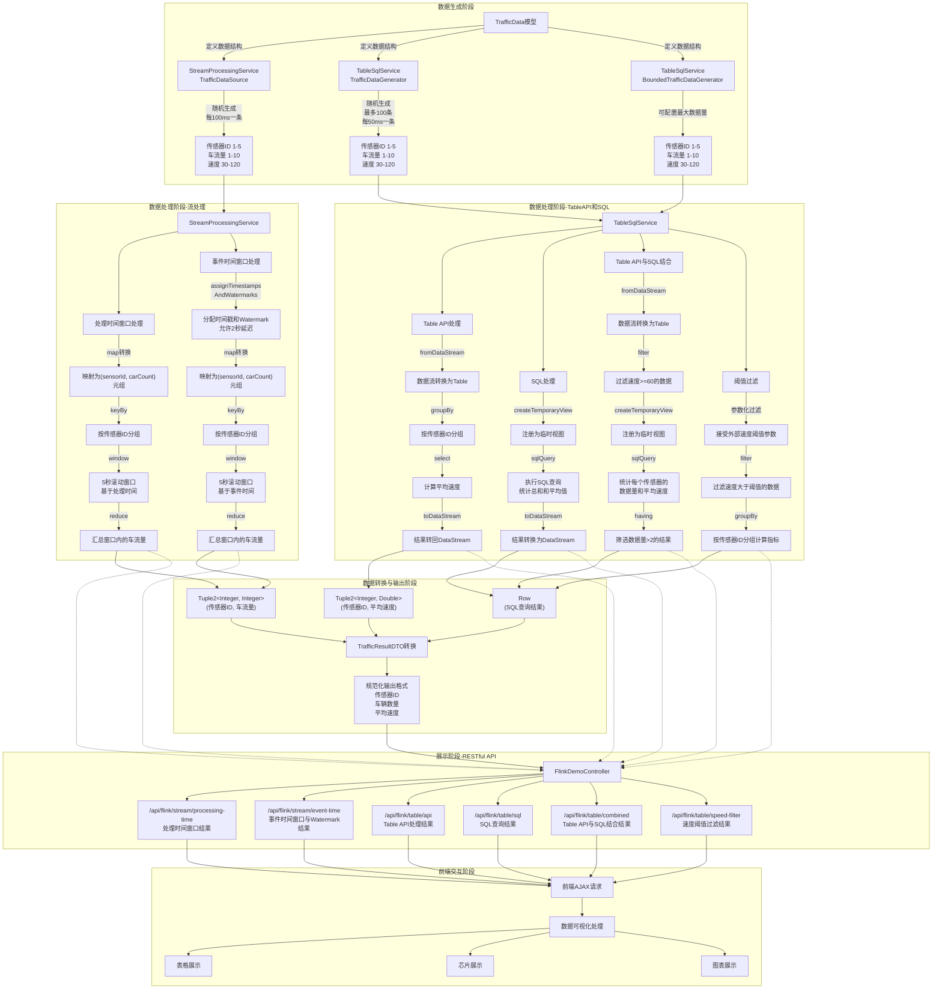

# Flink与Spring Boot集成示例

这个项目展示了如何将Apache Flink与Spring Boot进行集成，并提供了一系列示例展示Flink的核心功能。

## 项目特点

1. 同时支持Flink的批处理和流处理
2. 集成了Flink的Table API和SQL接口
3. 通过REST API提供Flink功能访问
4. 包含了时间窗口、Watermark等Flink核心概念的演示
5. 完整的前后端交互示例，展示Flink实时处理结果

## 知识点覆盖

本项目覆盖了以下Flink的核心知识点：

- **Flink简介**：通过代码展示了Flink的基本概念和特性
- **批处理与流处理**：同时实现了批处理和流处理示例
- **Time与Window**：展示了处理时间、事件时间以及窗口操作
- **Watermark**：演示了如何使用Watermark处理乱序数据
- **Flink算子**：包含了map、flatMap、filter、reduce等多种算子的使用
- **Table API与SQL**：演示了表格化处理和SQL查询功能

## 项目结构

```
src/main/java/com/example/flinkdemo/
  ├── FlinkDemoApplication.java         # 应用程序入口
  ├── config/
  │   └── FlinkConfig.java              # Flink环境配置
  ├── controller/
  │   ├── FlinkDemoController.java      # Flink功能REST接口
  │   └── HomeController.java           # 首页控制器
  ├── model/
  │   ├── TrafficData.java              # 交通数据模型
  │   └── TrafficResultDTO.java         # 交通结果数据传输对象
  └── service/
      ├── BatchProcessingService.java   # 批处理服务
      ├── StreamProcessingService.java  # 流处理服务
      └── TableSqlService.java          # Table API和SQL服务
```

## 快速开始

1. 克隆项目
2. 确保你已经安装了Java 11+和Maven
3. 进入项目目录，运行：`mvn spring-boot:run`
4. 访问 http://localhost:8080 查看项目首页
5. 通过Web界面或直接访问REST API来体验Flink功能

## 前后端交互与API接口

本项目提供了完整的前后端交互实现，下面详细介绍每个接口对应的Flink操作和实现的功能：

### 1. 批处理 - 基本转换

- **接口URL**: `/api/flink/batch/transform`
- **HTTP方法**: GET
- **Flink操作**: 
  - FlatMap: 将文本分割为单词
  - Map: 将单词转换为小写
  - Filter: 过滤长度大于4的单词
- **实现功能**: 演示Flink的基本转换操作，将输入文本分割为单词，转换为小写，并过滤长度大于4的单词
- **前端交互**: 点击"执行转换"按钮触发API调用，结果以单词芯片形式可视化展示
- **代码实现**:
  ```java
  DataSet<String> processedWords = textDataSet
      .flatMap((line, out) -> Arrays.stream(line.split("\\s+")).forEach(out::collect))
      .map(word -> word.toLowerCase())
      .filter(word -> word.length() > 4);
  ```

### 2. 批处理 - 分组聚合

- **接口URL**: `/api/flink/batch/aggregate`
- **HTTP方法**: GET
- **Flink操作**: 
  - Map: 转换数据格式
  - GroupBy: 按产品类别分组
  - Sum: 计算总和
- **实现功能**: 按产品类别分组，计算每个类别的销售总额
- **前端交互**: 点击"执行聚合"按钮触发API调用，结果以表格形式展示各类别销售总额
- **代码实现**:
  ```java
  DataSet<Tuple2<String, Integer>> categorySales = salesData
      .map(sale -> new Tuple2<>(sale.f0, sale.f2))
      .groupBy(0)
      .sum(1);
  ```

### 3. 流处理 - 处理时间窗口

- **接口URL**: `/api/flink/stream/processing-time`
- **HTTP方法**: GET
- **Flink操作**: 
  - Map: 数据转换为元组
  - KeyBy: 按传感器ID分组
  - Window: 使用5秒的处理时间滚动窗口
  - Reduce: 聚合计算窗口内的总车流量
- **实现功能**: 使用处理时间的滚动窗口统计各传感器的车流量
- **前端交互**: 点击"执行处理"按钮触发API调用，结果以表格形式展示各传感器车流量
- **代码实现**:
  ```java
  DataStream<Tuple2<Integer, Integer>> windowedStream = source
      .map(data -> new Tuple2<>(data.getSensorId(), data.getCarCount()))
      .keyBy(0)
      .window(TumblingProcessingTimeWindows.of(Time.seconds(5)))
      .reduce((t1, t2) -> new Tuple2<>(t1.f0, t1.f1 + t2.f1));
  ```

### 4. 流处理 - 事件时间窗口与Watermark

- **接口URL**: `/api/flink/stream/event-time`
- **HTTP方法**: GET
- **Flink操作**: 
  - AssignTimestampsAndWatermarks: 分配时间戳和设置水印
  - Map: 数据转换为元组
  - KeyBy: 按传感器ID分组
  - Window: 使用5秒的事件时间滚动窗口
  - Reduce: 聚合计算窗口内的总车流量
- **实现功能**: 使用事件时间的滚动窗口统计各传感器的车流量，并通过Watermark处理延迟数据
- **前端交互**: 点击相应按钮触发API调用，结果以表格形式展示
- **代码实现**:
  ```java
  DataStream<TrafficData> timestampedStream = source
      .assignTimestampsAndWatermarks(
          new BoundedOutOfOrdernessTimestampExtractor<TrafficData>(Time.seconds(2)) {
              @Override
              public long extractTimestamp(TrafficData data) {
                  return data.getEventTime().toEpochMilli();
              }
          });
  ```

### 5. Table API 演示

- **接口URL**: `/api/flink/table/api`
- **HTTP方法**: GET
- **Flink操作**: 
  - 数据分组: Group By
  - 聚合操作: 计算平均值
- **实现功能**: 使用Table API按传感器ID分组，计算平均速度
- **前端交互**: 点击"执行查询"按钮触发API调用，结果以表格形式展示各传感器平均速度
- **代码实现**:
  ```java
  List<Tuple2<Integer, Double>> results = new ArrayList<>();
  // 按传感器ID分组并计算平均速度
  for (Map.Entry<Integer, Double> entry : speedSums.entrySet()) {
      int sensorId = entry.getKey();
      double totalSpeed = entry.getValue();
      int totalCount = countSums.get(sensorId);
      double avgSpeed = totalSpeed / totalCount;
      
      results.add(new Tuple2<>(sensorId, avgSpeed));
  }
  ```

### 6. Table API与SQL结合

- **接口URL**: `/api/flink/table/combined`
- **HTTP方法**: GET
- **Flink操作**: 
  - Table API: 过滤速度大于等于60的数据
  - SQL: 分组聚合计算平均值和总数
- **实现功能**: 先使用Table API过滤数据，再使用SQL进行聚合查询
- **前端交互**: 点击"执行结合查询"按钮触发API调用，结果以表格形式展示过滤和聚合后的数据
- **代码实现**:
  ```java
  // 过滤速度大于等于60的数据
  List<TrafficData> filteredData = new ArrayList<>();
  for (TrafficData data : trafficDataList) {
      if (data.getSpeed() >= 60.0) {
          filteredData.add(data);
      }
  }
  
  // 按传感器ID分组并统计数量和平均速度
  Map<Integer, List<TrafficData>> groupedData = new HashMap<>();
  for (TrafficData data : filteredData) {
      int sensorId = data.getSensorId();
      if (!groupedData.containsKey(sensorId)) {
          groupedData.put(sensorId, new ArrayList<>());
      }
      groupedData.get(sensorId).add(data);
  }
  ```

### 7. 速度阈值过滤

- **接口URL**: `/api/flink/table/speed-filter`
- **HTTP方法**: GET
- **请求参数**: threshold (速度阈值)
- **Flink操作**: 
  - Filter: 过滤速度大于等于阈值的数据
  - KeyBy: 按传感器ID分组
  - Reduce: 汇总数据
  - Map: 计算平均速度
- **实现功能**: 根据用户输入的速度阈值过滤交通数据，并按传感器ID分组统计
- **前端交互**: 输入速度阈值并提交表单触发API调用，结果以表格形式展示
- **代码实现**:
  ```java
  DataStream<Row> resultStream = dataStream
      // 过滤速度大于等于阈值的数据
      .filter(data -> data.getSpeed() >= threshold)
      // 按传感器ID分组
      .keyBy(TrafficData::getSensorId)
      // 聚合操作
      .reduce((a, b) -> {
          a.setCarCount(a.getCarCount() + b.getCarCount());
          a.setSpeed(a.getSpeed() + b.getSpeed());
          return a;
      });
  ```

## 前后端交互流程

1. **用户交互**:
   - 用户访问Web界面，看到各种Flink功能演示卡片
   - 用户点击相应按钮触发特定功能

2. **前端处理**:
   - 前端JavaScript通过Fetch API调用后端接口
   - 显示加载状态，等待后端处理完成
   - 接收后端返回的JSON结果

3. **后端处理**:
   - 控制器接收请求并调用对应服务
   - Flink服务执行相应的批处理或流处理操作
   - 返回处理结果的JSON表示

4. **结果展示**:
   - 前端根据结果类型选择合适的可视化方式
   - 文本结果使用芯片形式展示
   - 数值和统计结果使用表格形式展示

## Flink核心概念

### 1. Flink 的四大基石
- **Checkpoint**：基于Chandy-Lamport算法实现的分布式一致性快照
- **State**：简单明了的状态管理API，包括ValueState、ListState等
- **Time**：支持处理时间、事件时间和摄入时间
- **Window**：支持各种窗口操作，包括滚动窗口、滑动窗口和会话窗口

### 2. 时间类型
- **处理时间（Processing Time）**：执行操作的机器系统时间
- **事件时间（Event Time）**：数据实际产生的时间
- **摄入时间（Ingestion Time）**：数据进入Flink的时间

### 3. 窗口类型
- **滚动窗口（Tumbling Window）**：固定大小、不重叠的窗口
- **滑动窗口（Sliding Window）**：固定大小、可重叠的窗口
- **会话窗口（Session Window）**：活动间隙来划分的窗口

## 交通数据处理流程图

下面的流程图详细展示了TrafficData从生成到最终输出的完整处理链路：



此流程图详细展示了整个TrafficData数据处理链路，包括数据生成、流处理、Table API和SQL处理、数据转换与最终通过RESTful API进行展示的完整过程。

## 参考资料

- [Apache Flink官方文档](https://flink.apache.org/docs/stable/)
- [Spring Boot官方文档](https://spring.io/projects/spring-boot)
- [Thymeleaf官方文档](https://www.thymeleaf.org/documentation.html) 